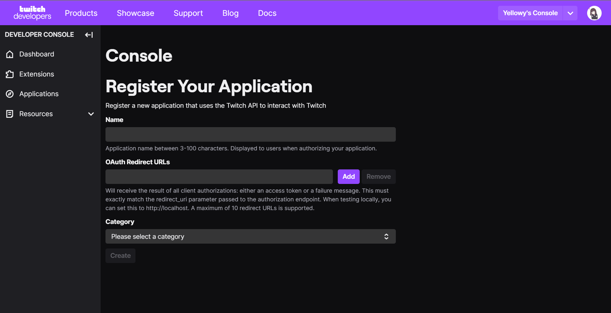
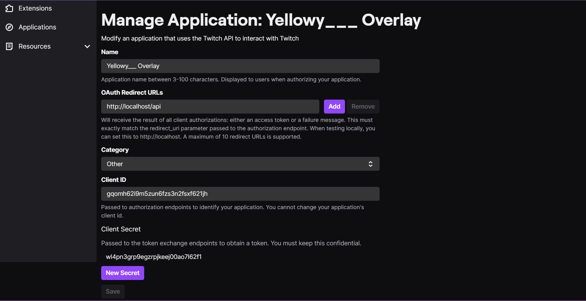

# Twitch Overlay

## links

[Overview](#overview)

[Source Installation](#source-installation)

[EXE Installation](#exe-installation)

# Overview

This is a web based overlay for OBS, Twitch Studio, Streamlabs, etc.

The current features are below

- [x] Chatbox
- [x] Followers
- [x] Subs
- [x] Resubs
- [ ] Gift Subs
- [ ] Raids

# Source Installation

First you need to either clone this repo or install the source.

If you clone the repo then rename the base.config.json to config.json and fill out only the channel, client_id, and client_secret. In the channel field just put your channel name in all lowercase. To get client_id and client_secret go [here](https://dev.twitch.tv) and press log in in the top right corner, once you've logged in it'll be replaced with **Your Console** click that. Then near Applications you should see a button that says **Register Your Application** click that and you should be directed to a page that looks like the photo below.



Once you are here fill out Name to whatever you want a suggested name is **Your twitch name** Overlay (ex. Yellowy___'s Overlay) and put OAuth Redirect URLs to http://localhost/api and Category to Other and then click on Create. After that you should be directed to a page like below, if not then on the left side click on Applications then click on manage next to the application you just created



At the bottom of the page you should see a **New Secret** button once you click this a popup should show up asking if you want to generate a new secret click on yes and your client secret should appear above the buton you clicked paste this inside the "" next to clinet_secret in your config.json. Then above the Client Secret on the website you should see Client ID copy this and paste it inside of the "" next to client_id. Finally inside the "" next to channel put your twitch name in all lower case it should look like the code below

```json
{
    "channel": "yellowy___",
    "client_id": "gqomh62i9m5zun6fzs3n2fsxf621jh",
    "client_secret": "wl4pn3grp9egzrpjkeej00ao7l62f1",
    "token": {
        "access_token": "",
        "expires_in": 0,
        "token_type": ""
    }
}
```

After you've done all that cd into the folder and run the below command

```sh
node .
```

You should see a url to click once you do and authorize the application you made before the tokens in config.json should propagate

# EXE Installation

You first need to install the exe from the [Releases](https://github.com/TheDevYellowy/overlay/releases) tab then run the exe once before doing the steps below, this will create the required files.

After you've ran the exe once go [here](https://dev.twitch.tv) and click on **Log in with twitch** once you've logged in the button will change to **Your Console** click on this and near the Applications text there should be a button called **Register Your Application** click on this and you should be redirected to a page like the image below


In the **Name** field but any name but a recomended name is **Your twitch name** Overlay (ex. Yellowy___'s Overlay). Then in the **OAuth Redirect URL's** field put http://localhost/api adn finally for **Category** put Other. Once you've done that click on Create and you should be redirected to a page like the one below if not click on Applications on the left side of the website and find the application you just created then click on **Manage**.


At the bottom of the page you should see a **New Secret** button once you click this a popup should show up asking if you want to generate a new secret click on yes and your client secret should appear above the buton you clicked paste this inside the "" next to clinet_secret in your config.json. Then above the Client Secret on the website you should see Client ID copy this and paste it inside of the "" next to client_id. Finally inside the "" next to channel put your twitch name in all lower case it should look like the code below

```json
{
    "channel": "yellowy___",
    "client_id": "gqomh62i9m5zun6fzs3n2fsxf621jh",
    "client_secret": "wl4pn3grp9egzrpjkeej00ao7l62f1",
    "token": {
        "access_token": "",
        "expires_in": 0,
        "token_type": ""
    }
}
```

after you've done all this click on the exe once again you should see a url that's been generated click this and press authorize after that you should be redirected to your channels moderator view and the token object inside the config.json shoud have been propagated with data.
